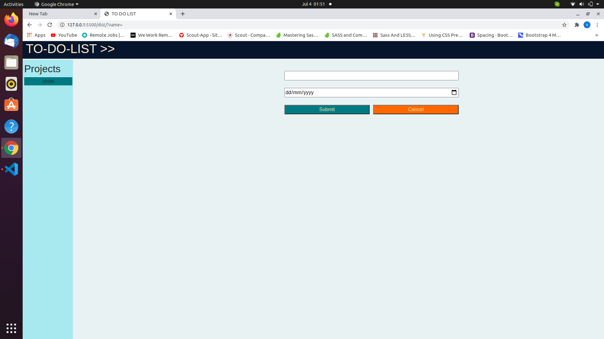
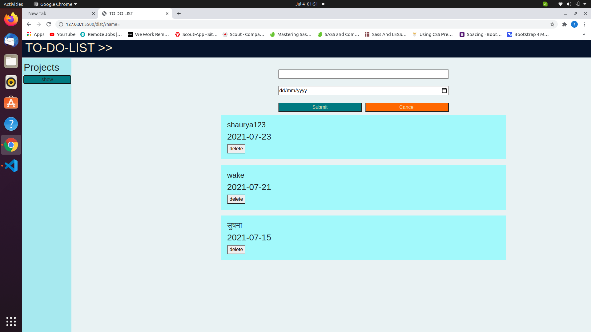
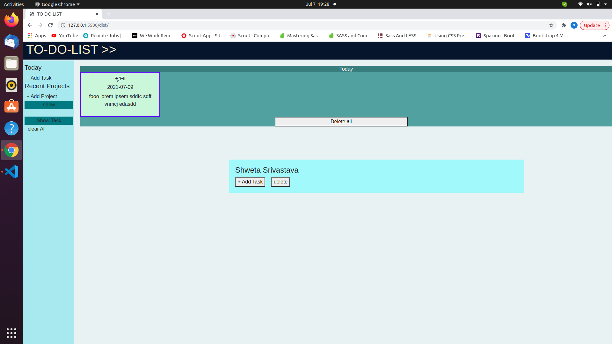
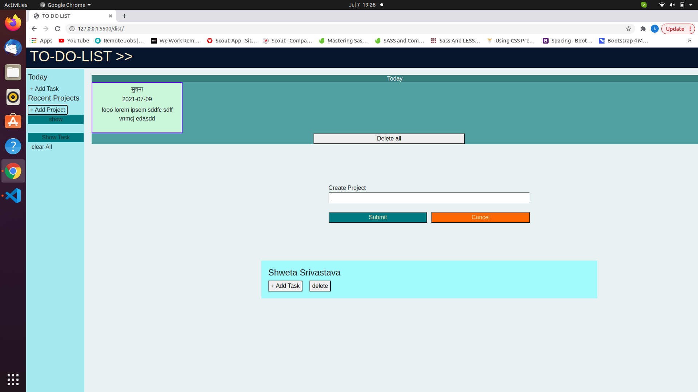
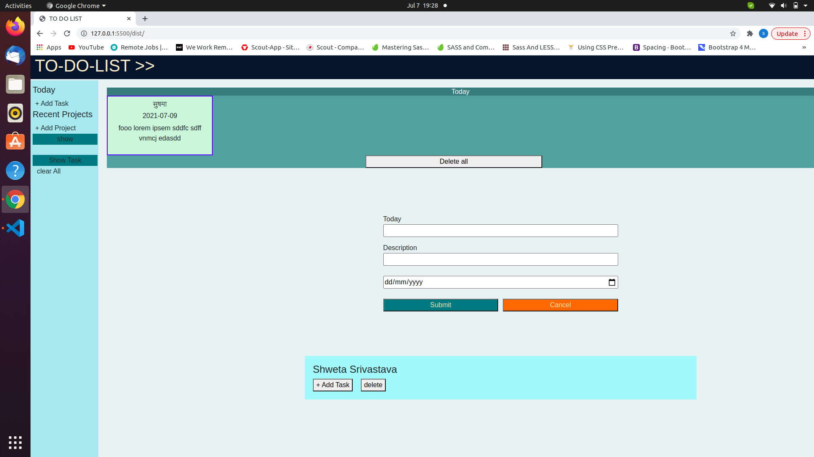
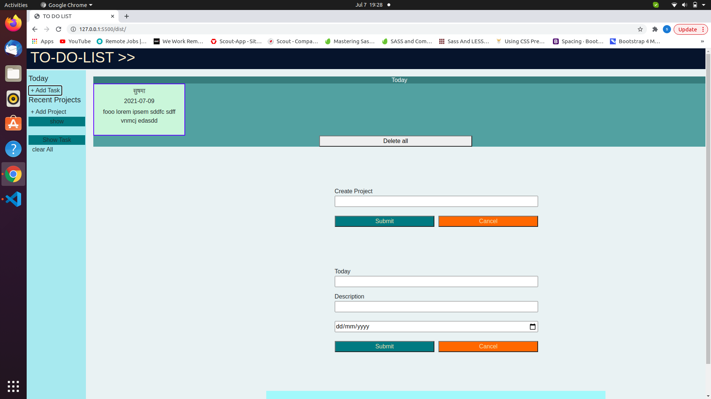

# todo_list

Todo list is an app which create list of projects along with their date. we can also add task to each project by default one project "today" is given to which any task can be added, task name cannot be empty. here localstorage has been used to save data.

## Built With

javascript

## Live Demo

[Try a lıve demo](https://vidhishweta01.github.io/todo_list/)

## Getting Started

Download or clone this repo by using :

## $ git clone https://github.com/vidhishweta01/todo_list.git

do follow these steps given below:

1. Change directory to the root of project.

## $ cd todo_list

2. install all dev dependencies

## $ npm istall

## Authors 👤

### Shweta Srivastava

_[Github](https://github.com/vidhishweta01)

_[LinkedIn](http://linkedin.com/in/shweta-s-15a57070)

## Show your support ⭐️⭐️

Give a star if you like this project!

## License 📝

This project is [MIT](https://www.mit.edu/~amini/LICENSE.md) licensed.
